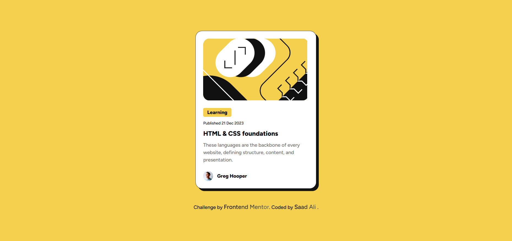
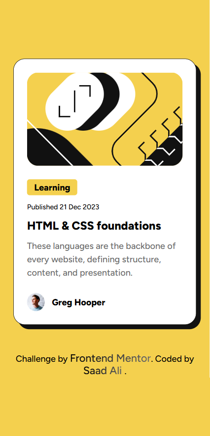

# Frontend Mentor – Blog Preview Card Solution

This is a solution to the **Blog Preview Card** challenge on Frontend Mentor.  
Frontend Mentor challenges help you improve your coding skills by building realistic, production-ready components.

---

## 📋 Overview

### 🔹 The Challenge

Users should be able to:

- View the blog card at its optimal layout on all screen sizes  
- See a clean and balanced visual hierarchy  
- Interact with hover states on the blog title  
- Experience a responsive, centered layout using modern CSS techniques  
- View custom locally-hosted fonts using `@font-face`

---

### 🖼️ Screenshot

**Desktop View**  

**Mobile View**  

---

### 🔗 Links

- **Live Site URL:** [View Live](https://bytesaad.github.io/blog-preview-card-main/)

---

## 💡 My Process

### 🔧 Built With

- Semantic **HTML5 markup** (`article`, `footer`)  
- **CSS Custom Properties** (color tokens)  
- **Flexbox** and **CSS Grid** for layout  
- Mobile-first workflow  
- `@font-face` for local custom fonts  
- Component-based class structure  
- Clean, accessible images with proper `alt` text

---

### 🧠 What I Learned

This project helped me strengthen:

#### ✔ Using `@font-face` for local font loading
I learned how to load static font files (`.ttf`) locally and assign correct `font-weight` values for cleaner typography.

#### ✔ Improving Accessibility

- Providing descriptive `alt` text  
- Using semantic tags (`article`, `footer`)  
- Using consistent typography scale

---

## 📚 Useful Resources

- **Kevin Powell – Modern CSS Techniques**  
  [https://www.youtube.com/@KevinPowell](https://www.youtube.com/@KevinPowell)  
  Great explanations for layout strategies and responsive design.

- **MDN – `@font-face` Documentation**  
  Clear explanation of font loading and formats.

---

## 👨‍💻 Author

- **Frontend Mentor:** [@Saad Ali](https://www.frontendmentor.io/profile/ByteSaad)  
- **GitHub:** [@ByteSaad](https://github.com/ByteSaad)
